# 🛡️ Sentinel AK-XL - Virtual Security Operations Center

> **Note**
> A comprehensive Virtual SOC environment engineered for cybersecurity education and professional training, featuring enterprise-grade SIEM capabilities, real-time threat detection, and advanced analytics.

<p align="center">
  
</p>

## 📋 Table of Contents

- [What is a Security Operations Center (SOC)?](#what-is-a-security-operations-center-soc)
- [Project Overview](#project-overview)
- [Team Members](#team-members)
- [Architecture & Data Flow](#architecture--data-flow)
- [SOC Dashboards](#soc-dashboards)
- [Quick Start](#quick-start)
- [System Requirements](#system-requirements)
- [Installation](#installation)
- [SOC Capabilities](#soc-capabilities)
- [Training Scenarios](#training-scenarios)
- [Configuration](#configuration)
- [Management Commands](#management-commands)
- [Troubleshooting](#troubleshooting)
- [Documentation](#documentation)
- [Contributing](#contributing)
- [License](#license)

## What is a Security Operations Center (SOC)?

A **Security Operations Center (SOC)** is a centralized facility where cybersecurity professionals continuously monitor, detect, analyze, and respond to security incidents across an organization's IT infrastructure. SOCs serve as the nerve center for cybersecurity operations, combining people, processes, and technology to:

- **Monitor** networks, systems, and applications 24/7 for security threats
- **Detect** malicious activities through advanced analytics and threat intelligence
- **Analyze** security events to distinguish real threats from false positives
- **Respond** to confirmed incidents with appropriate containment and remediation
- **Report** on security posture and incident trends to management

Modern SOCs leverage SIEM (Security Information and Event Management) platforms, threat intelligence feeds, and automated response capabilities to handle the volume and complexity of today's cyber threat landscape.

## Project Overview

Sentinel AK-XL is a production-grade Virtual SOC platform designed to provide hands-on cybersecurity education and professional training. This project was developed as the capstone requirement for a specialized cybersecurity program, demonstrating advanced proficiency in security operations, threat detection, and incident response.

> **Important**
> This platform integrates industry-standard tools including ELK Stack 9.1.2, Wazuh 4.12.0, and enterprise security frameworks to deliver authentic SOC analyst experience.

### Educational Objectives

**Core Deliverables:**
- ✅ Professional SOC dashboards with real-time threat monitoring
- ✅ Comprehensive alert workflows and analyst playbooks
- ✅ Realistic attack simulation scripts for hands-on training
- ✅ Complete SOC operational procedures and documentation

**Skills Development:**
- **SIEM Configuration & Management**: Enterprise-level security platform deployment
- **Threat Detection & Analysis**: Real-time security event correlation and investigation
- **Incident Response**: Structured approaches to security incident handling
- **Security Analytics**: Advanced data visualization and threat intelligence integration

## Team Members

This project was collaboratively developed by cybersecurity specialists:

- **Abimael Pérez** - Project Lead & SOC Architecture
- **Xavier Cruz** - Infrastructure Engineering & Automation
- **Luis Soto** - Attack Simulation & Security Testing

## Architecture & Data Flow

Sentinel AK-XL implements a sophisticated dual-stack architecture that provides both native SIEM capabilities and enhanced analytics through the ELK stack.

```mermaid
flowchart TD
  %% High-contrast palette and legible labels
  classDef src fill:#FDF6B2,stroke:#8B5E00,color:#111,stroke-width:1.2px;
  classDef ok fill:#E6F4EA,stroke:#1E7D32,color:#111,stroke-width:1.2px;
  classDef proc fill:#E8F0FE,stroke:#1A73E8,color:#111,stroke-width:1.2px;
  classDef store fill:#FFF1F1,stroke:#C5221F,color:#111,stroke-width:1.2px;
  classDef ui fill:#F3E8FF,stroke:#9333EA,color:#111,stroke-width:1.2px;
  classDef note fill:#F1F5F9,stroke:#475569,color:#111,stroke-width:1.2px;
  %% Scenario Simulator (source of test events)
  SIM["Scenario Simulator<br/>(ssh-auth-simulator,<br/>malware & network generators)"]:::src
  %% Data sources inside the manager namespace
  subgraph SOURCES["Data Sources (within host & Wazuh)"]
    AUTH["/var/log/auth.log<br/>(SSH Auth)"]:::src
    NETLOG["/var/ossec/logs/test/network.log<br/>(Network Events)"]:::src
    FIM["/var/ossec/data/fimtest/<br/>(File Integrity)"]:::src
  end
  %% Wazuh Manager
  subgraph WMGR["Wazuh Manager 4.12.0"]
    WM["Analysis & Decoders"]:::proc
    ALERTS["alerts.json<br/>(shared volume)"]:::note
    VT["VirusTotal Integration<br/>(HTTPS API)"]:::proc
    FB_INT["Filebeat (Internal, stock)<br/>→ Wazuh Indexer (TLS OK)"]:::ok
  end
  %% Wazuh Native Stack
  subgraph STACK1["Stack 1: Wazuh Native"]
    WIDX["Wazuh Indexer :9200 (internal)<br/>exposed :9201"]:::store
    WUI["Wazuh Dashboard :5601 (internal)<br/>exposed :8443"]:::ui
  end
  %% ELK Enhanced Stack
  subgraph STACK2["Stack 2: ELK Enhanced Analytics"]
    FB_EXT["Filebeat (External Container)<br/>→ Logstash :5044"]:::ok
    LS["Logstash :5044/:8080/:9600<br/>(GeoIP Enrichment)"]:::proc
    ES["Elasticsearch :9200<br/>(sentinel-logs-*)"]:::store
    KB["Kibana :5601<br/>(Custom Dashboards)"]:::ui
  end
  %% Simulator feeds the sources and direct HTTP testing path
  SIM --> AUTH
  SIM --> NETLOG
  SIM --> FIM
  SIM -.->|HTTP :8080 optional dev test| LS
  %% Wazuh data flow
  AUTH --> WM
  NETLOG --> WM
  FIM --> WM
  WM --> ALERTS
  WM <--> VT
  %% Dual fan-out from alerts.json
  ALERTS --> FB_INT
  ALERTS --> FB_EXT
  %% Stacks
  FB_INT --> WIDX --> WUI
  FB_EXT --> LS --> ES --> KB
```



### Technology Stack

- **ELK Stack 9.1.2**: Centralized logging, processing, and visualization
- **Wazuh 4.12.0**: SIEM detection engine with real-time monitoring
- **Docker**: Containerized deployment for scalability and portability
- **VirusTotal API**: Threat intelligence integration for malware detection
- **GeoIP**: Geographic enrichment for threat source analysis
- **Sysmon**: Advanced Windows endpoint monitoring

## SOC Dashboards

The platform features four professional-grade dashboards designed for comprehensive security monitoring:

### 1. SOC Overview Dashboard


**Purpose**: Executive-level security posture monitoring  
**Key Metrics**: Alert volume trends, geographic threat distribution, service health status

### 2. SSH Authentication Monitoring


**Purpose**: Real-time authentication threat detection  
**Features**: Failed login analysis, brute force detection, geographic attack mapping

### 3. Network Analysis - Part 1


**Purpose**: Network traffic and connection monitoring  
**Capabilities**: Top talkers analysis, port scanning detection, protocol distribution

### 4. Network Analysis - Part 2


**Features**: Geographic traffic flow, connection patterns, network anomaly detection

### 5. Threat Intelligence


**Purpose**: Malware and IOC tracking  
**Integration**: VirusTotal detections, file integrity monitoring, hash reputation analysis

## Quick Start

> **Warning**
> Ensure your system meets the minimum requirements before proceeding with installation.

### Prerequisites
- **OS**: Linux (Ubuntu 20.04+) or WSL2 on Windows
- **Docker Engine**: 20.10+
- **Docker Compose**: 2.0+
- **Memory**: 10GB RAM minimum (adjust WSL to 10GB + 2GB swap)
- **Storage**: 50GB+ free disk space
- **CPU**: 4+ cores recommended

### Rapid Deployment

```bash
# 1. Clone repository
git clone https://github.com/AbimaelPerezVega/Sentinel-AK-XL.git
cd Sentinel-AK-XL

# 2. Configure environment
cat > .env << EOF
# Wazuh Authentication
WAZUH_INDEXER_PASSWORD=SecurePassword123
WAZUH_API_PASSWORD=SecurePassword123

# Threat Intelligence
VIRUSTOTAL_API_KEY=your-virustotal-api-key
EOF

# 3. System optimization
sudo sysctl -w vm.max_map_count=262144
echo 'vm.max_map_count=262144' | sudo tee -a /etc/sysctl.conf

# 4. Start all services
docker compose up -d
docker compose -f docker-compose-wazuh.yml up -d

# 5. Verify deployment
curl http://localhost:9200/_cluster/health
curl http://localhost:55000
```

### Access Points
- **Kibana SOC Dashboards**: http://localhost:5601
- **Wazuh Dashboard**: https://localhost:8443
- **Elasticsearch API**: http://localhost:9200
- **Wazuh Manager API**: http://localhost:55000

## System Requirements

### Hardware Specifications

| Component | Minimum | Recommended | Production |
|-----------|---------|-------------|------------|
| **CPU** | 4 cores | 6 cores | 8+ cores |
| **RAM** | 10GB | 16GB | 24GB+ |
| **Storage** | 50GB | 100GB SSD | 200GB+ NVMe |
| **Network** | 10Mbps | 100Mbps | 1Gbps+ |

### Software Dependencies

| Software | Version | Purpose |
|----------|---------|---------|
| Docker Engine | 20.10+ | Container runtime |
| Docker Compose | 2.0+ | Orchestration |
| Git | Latest | Version control |
| curl | Latest | API testing |

### Network Ports

| Service | Port | Protocol | Purpose |
|---------|------|----------|---------|
| Elasticsearch | 9200 | HTTP | Data storage API |
| Kibana | 5601 | HTTP | Web dashboard |
| Logstash | 5044 | TCP | Beats input |
| Wazuh Manager | 55000 | HTTP | Management API |
| Wazuh Indexer | 9201 | HTTP | Native storage |
| Wazuh Dashboard | 8443 | HTTPS | SIEM interface |

## Installation

### Detailed Setup Process

#### 1. Environment Preparation
```bash
# Install Docker (Ubuntu/Debian)
curl -fsSL https://get.docker.com -o get-docker.sh
sudo sh get-docker.sh
sudo usermod -aG docker $USER

# Install Docker Compose
sudo curl -L "https://github.com/docker/compose/releases/latest/download/docker-compose-$(uname -s)-$(uname -m)" -o /usr/local/bin/docker-compose
sudo chmod +x /usr/local/bin/docker-compose
```

#### 2. Memory Configuration
```bash
# For systems with 10-16GB RAM
cat > .env << EOF
ES_MEM=2g
KIBANA_MEM=1g
LOGSTASH_MEM=1g
WAZUH_MEM=2g
EOF

# For systems with 16GB+ RAM
cat > .env << EOF
ES_MEM=4g
KIBANA_MEM=1g
LOGSTASH_MEM=2g
WAZUH_MEM=3g
EOF
```

#### 3. Service Deployment
```bash
# Start ELK Stack
docker compose up -d elasticsearch
sleep 30
docker compose up -d kibana logstash

# Start Wazuh Stack
docker compose -f docker-compose-wazuh.yml up -d wazuh-indexer
sleep 30
docker compose -f docker-compose-wazuh.yml up -d wazuh-manager wazuh-dashboard
```

#### 4. Verification & Testing
```bash
# Health checks
curl -s http://localhost:9200/_cluster/health | jq '.status'
curl -s http://localhost:55000 | jq '.data'

# Service status
docker compose ps
docker compose -f docker-compose-wazuh.yml ps
```

## SOC Capabilities

### Current Detection Coverage

```
Overall Progress: ████████████████████ 100%

- ✅ Infrastructure & SIEM: ████████████████████ 100%
- ✅ SOC Dashboards:        ████████████████████ 100%
- ✅ Endpoint Monitoring:   ████████████████████ 100%
- ✅ Attack Simulation:     ████████████████████ 100%
- ✅ Security Hardening:    ████████████████████ 100%
- ✅ Documentation:         ████████████████████ 100%
```

### Detection Capabilities

| Category | Coverage | Description |
|----------|----------|-------------|
| **Network Attacks** | ✅ Complete | Port scanning, brute force, geographic anomalies |
| **Malware Detection** | ✅ Complete | File integrity monitoring with VirusTotal integration |
| **Authentication** | ✅ Complete | SSH/RDP monitoring, credential spray detection |
| **Threat Intelligence** | ✅ Complete | Real-time IOC enrichment and reputation scoring |
| **Geographic Analysis** | ✅ Complete | GeoIP-based threat source identification |

### SIEM Rules Active

- **Custom Detection Rules**: 8 production rules
- **MITRE ATT&CK Coverage**: Initial Access, Execution, Discovery
- **Alert Response Time**: < 5 minutes for critical alerts
- **False Positive Rate**: < 15% (tuned for accuracy)

## Training Scenarios

### Attack Simulation Suite

The platform includes comprehensive attack simulation scripts for realistic SOC training:

#### 1. SSH Authentication Attacks
```bash
# Copy simulator to Wazuh container
docker cp scenarios-simulator/ssh-auth/ssh-auth-simulator.sh \
  sentinel-wazuh-manager:/usr/local/bin/

# Execute brute force simulation
docker exec -it sentinel-wazuh-manager \
  /usr/local/bin/ssh-auth-simulator -p fast_brute -n 20 -v
```

**Training Objectives:**
- Authentication threat detection
- Geographic attack analysis
- Brute force pattern recognition
- Incident response procedures

#### 2. Malware Detection Scenarios
```bash
# Deploy malware simulator
docker cp scenarios-simulator/malware-drop/malware-drop-simulator.sh \
  sentinel-wazuh-manager:/usr/local/bin/

# Execute file integrity monitoring test
docker exec -it sentinel-wazuh-manager \
  /usr/local/bin/malware-drop-simulator 10 3
```

**Training Objectives:**
- File integrity monitoring
- VirusTotal integration
- Malware analysis workflows
- Hash reputation assessment

#### 3. Network Reconnaissance
```bash
# Deploy network simulator
docker cp scenarios-simulator/network/network-activity-simulator.sh \
  sentinel-wazuh-manager:/usr/local/bin/

# Execute port scanning simulation
docker exec -it sentinel-wazuh-manager \
  /usr/local/bin/network-activity-simulator -p portscan_fast -n 15 -v
```

**Training Objectives:**
- Network anomaly detection
- Port scanning identification
- Traffic pattern analysis
- Network-based threat hunting

### Learning Outcomes

**Technical Competencies:**
- SIEM platform administration and configuration
- Security event correlation and analysis
- Incident response workflow execution
- Threat intelligence integration and utilization

**Professional Skills:**
- SOC analyst operational procedures
- Security documentation and reporting
- Cross-platform tool integration
- Collaborative security operations

## Configuration

### Environment Variables

Key configuration parameters for deployment customization:

```bash
# Security Configuration
WAZUH_INDEXER_PASSWORD=your-secure-password
WAZUH_API_PASSWORD=your-api-password
VIRUSTOTAL_API_KEY=your-vt-api-key

# Memory Allocation
ES_MEM=2g
KIBANA_MEM=1g
LOGSTASH_MEM=1g
WAZUH_MEM=2g

# Network Configuration
COMPOSE_PROJECT_NAME=sentinel-akxl
```

### Configuration Files

```
configs/
├── elk/
│   ├── elasticsearch/elasticsearch.yml  # Cluster configuration
│   ├── kibana/kibana.yml               # Dashboard settings
│   └── logstash/conf.d/main.conf       # Processing pipeline
└── wazuh/
    ├── manager/wazuh_manager.conf       # SIEM rules and alerts
    ├── rules/local_rules.xml            # Custom detection rules
    └── indexer/wazuh.indexer.yml        # Storage configuration
```

## Management Commands

### Service Operations

```bash
# Complete system startup
docker compose up -d
docker compose -f docker-compose-wazuh.yml up -d

# Graceful shutdown
docker compose down
docker compose -f docker-compose-wazuh.yml down

# Service-specific operations
docker compose restart elasticsearch
docker compose logs -f kibana
docker stats
```

### Health Monitoring

```bash
# System status verification
curl -s http://localhost:9200/_cluster/health | jq '.status'
curl -s http://localhost:55000 | jq '.data.api_version'

# Performance monitoring
curl -s http://localhost:9600/_node/stats | jq '.pipeline.events'
curl -s "http://localhost:9200/_cat/indices/sentinel-logs-*?v"
```

### Data Management

```bash
# Index management
curl -X DELETE "http://localhost:9200/sentinel-logs-2024.08.*"

# Configuration backup
tar -czf config-backup-$(date +%Y%m%d).tar.gz configs/

# Volume cleanup (⚠️ Data loss)
docker compose down -v
docker system prune -f
```

## Troubleshooting

### Common Issues

> **Tip**
> Most deployment issues relate to insufficient memory allocation or port conflicts.

#### Memory-Related Issues

**Symptom**: Elasticsearch fails to start  
**Solution**:
```bash
# Check available memory
free -h

# Reduce memory allocation
echo 'ES_MEM=1g' >> .env
docker compose restart elasticsearch
```

#### Port Conflicts

**Symptom**: "Port already in use" errors  
**Solution**:
```bash
# Identify conflicting processes
sudo netstat -tulpn | grep -E "(9200|5601|55000)"

# Stop conflicting services
sudo systemctl stop elasticsearch kibana
```

#### SSL Certificate Issues

**Symptom**: TLS connection errors  
**Solution**:
```bash
# Regenerate certificates
./wazuh-certs-tool.sh

# Restart affected services
docker compose -f docker-compose-wazuh.yml restart wazuh-indexer wazuh-manager
```

### Performance Optimization

#### Resource Monitoring
```bash
# Container resource usage
docker stats --format "table {{.Container}}\t{{.CPUPerc}}\t{{.MemUsage}}"

# Elasticsearch performance
curl -s "http://localhost:9200/_nodes/stats/indices?pretty"
```

#### Query Performance
```bash
# Index statistics
curl -s "http://localhost:9200/_cat/indices?v&s=store.size:desc"

# Cluster performance
curl -s "http://localhost:9200/_cluster/stats?pretty"
```

## Documentation

Comprehensive documentation is available in the `docs/` directory:

- **[Installation Guide](docs/01-getting-started/installation-guide.md)** - Detailed setup procedures
- **[User Guide](docs/03-operations/soc-analyst-user-guide.md)** - SOC analyst operations
- **[Admin Guide](docs/03-operations/system-administrator-guide.md)** - System administration
- **[Analyst Playbooks](docs/04-analyst-playbooks/)** - Incident response procedures
- **[Simulation Scenarios](docs/05-simulation-scenarios/)** - Training scenario guides

## Contributing

We welcome contributions to enhance the Sentinel AK-XL platform:

### Development Guidelines

1. **Fork** the repository
2. **Create** a feature branch (`git checkout -b feature/enhancement`)
3. **Test** thoroughly in development environment
4. **Document** changes and update relevant guides
5. **Submit** pull request with clear description

### Areas for Contribution

- Additional attack simulation scenarios
- Enhanced dashboard visualizations
- Extended detection rule coverage
- Documentation improvements
- Performance optimizations

## License

This project is licensed under the MIT License - see the [LICENSE](LICENSE) file for details.

---

> **Success**
> Sentinel AK-XL represents a comprehensive approach to cybersecurity education, providing hands-on experience with enterprise-grade security tools and real-world attack scenarios. The platform serves as a bridge between academic learning and professional cybersecurity operations.

**Repository**: https://github.com/AbimaelPerezVega/Sentinel-AK-XL  
**Version**: 1.0  
**Status**: Production Ready  
**Last Updated**: September 2025