# 📡 Sentinel SOC – Data Flow & Enrichment Guide

This guide documents the **current dual‑stack architecture**, the now‑resolved **SSL certificate** path, where **GeoIP** and **VirusTotal** enrichment happen, and the **testing & troubleshooting** procedures. It reflects the latest working state: **Wazuh internal Filebeat restored to stock (no custom mount)** and **SSL configured as per vendor documentation**.

---

## 1) Current Dual‑Stack Data Flow (with Scenario Simulator)

Two independent pipelines consume the same source and can be used in parallel:

* **Stack 1 – Wazuh Native**: Wazuh Manager → Wazuh Indexer → Wazuh Dashboard.
* **Stack 2 – ELK Enhanced**: Wazuh Manager → External Filebeat → Logstash (GeoIP) → Elasticsearch → Kibana.

```mermaid
flowchart TD
  %% High-contrast palette and legible labels
  classDef src fill:#FDF6B2,stroke:#8B5E00,color:#111,stroke-width:1.2px;
  classDef ok fill:#E6F4EA,stroke:#1E7D32,color:#111,stroke-width:1.2px;
  classDef proc fill:#E8F0FE,stroke:#1A73E8,color:#111,stroke-width:1.2px;
  classDef store fill:#FFF1F1,stroke:#C5221F,color:#111,stroke-width:1.2px;
  classDef ui fill:#F3E8FF,stroke:#9333EA,color:#111,stroke-width:1.2px;
  classDef note fill:#F1F5F9,stroke:#475569,color:#111,stroke-width:1.2px;
  %% Scenario Simulator (source of test events)
  SIM["Scenario Simulator<br/>(ssh-auth-simulator,<br/>malware & network generators)"]:::src
  %% Data sources inside the manager namespace
  subgraph SOURCES["Data Sources (within host & Wazuh)"]
    AUTH["/var/log/auth.log<br/>(SSH Auth)"]:::src
    NETLOG["/var/ossec/logs/test/network.log<br/>(Network Events)"]:::src
    FIM["/var/ossec/data/fimtest/<br/>(File Integrity)"]:::src
  end
  %% Wazuh Manager
  subgraph WMGR["Wazuh Manager 4.12.0"]
    WM["Analysis & Decoders"]:::proc
    ALERTS["alerts.json<br/>(shared volume)"]:::note
    VT["VirusTotal Integration<br/>(HTTPS API)"]:::proc
    FB_INT["Filebeat (Internal, stock)<br/>→ Wazuh Indexer (TLS OK)"]:::ok
  end
  %% Wazuh Native Stack
  subgraph STACK1["Stack 1: Wazuh Native"]
    WIDX["Wazuh Indexer :9200 (internal)<br/>exposed :9201"]:::store
    WUI["Wazuh Dashboard :5601 (internal)<br/>exposed :8443"]:::ui
  end
  %% ELK Enhanced Stack
  subgraph STACK2["Stack 2: ELK Enhanced Analytics"]
    FB_EXT["Filebeat (External Container)<br/>→ Logstash :5044"]:::ok
    LS["Logstash :5044/:8080/:9600<br/>(GeoIP Enrichment)"]:::proc
    ES["Elasticsearch :9200<br/>(sentinel-logs-*)"]:::store
    KB["Kibana :5601<br/>(Custom Dashboards)"]:::ui
  end
  %% Simulator feeds the sources and direct HTTP testing path
  SIM --> AUTH
  SIM --> NETLOG
  SIM --> FIM
  SIM -.->|HTTP :8080 optional dev test| LS
  %% Wazuh data flow
  AUTH --> WM
  NETLOG --> WM
  FIM --> WM
  WM --> ALERTS
  WM <--> VT
  %% Dual fan-out from alerts.json
  ALERTS --> FB_INT
  ALERTS --> FB_EXT
  %% Stacks
  FB_INT --> WIDX --> WUI
  FB_EXT --> LS --> ES --> KB

```



**Key updates**

* **SSL certificate path is resolved** for the Wazuh Native stack. Internal Filebeat communicates with Wazuh Indexer using TLS per vendor guidance.
* **Internal Filebeat is running with stock configuration** (no read‑only custom mount). The container’s original module wiring is intact.
* **Scenario Simulator** is explicitly connected at the top and fans out to the three data sources.

---

## 2) Component Architecture and Service Mapping

### Filebeat roles

**Internal Filebeat (in Wazuh Manager)**

* **Purpose**: Native Wazuh pipeline to Wazuh Indexer.
* **Config State**: **Stock** (no custom `filebeat.yml` mount). Modules and inputs managed by the image.
* **Security**: **TLS/SSL configured and working** against the Wazuh Indexer, per vendor documentation.
* **Target**: `wazuh-indexer:9200` (internal), exposed as host `:9201`.

**External Filebeat (separate container)**

* **Purpose**: ELK pipeline for advanced analytics and enrichment.
* **Target**: `logstash:5044` (Beats input). Also supports HTTP dev injection on `:8080`.
* **Status**: Operational and primary path for Kibana dashboards.

### Service Port Reference

| Component             | Version | Internal Port(s) | Host/Exposed     | Purpose                       | Status       |
| --------------------- | ------: | ---------------- | ---------------- | ----------------------------- | ------------ |
| **Elasticsearch**     |   9.1.2 | 9200             | 9200             | Data store (sentinel-logs-\*) | ✅ Working    |
| **Kibana**            |   9.1.2 | 5601             | 5601             | Dashboards (ELK)              | ✅ Working    |
| **Logstash**          |   9.1.2 | 5044, 8080, 9600 | 5044, 8080, 9600 | Ingest + GeoIP                | ✅ Working    |
| **Wazuh Manager**     |  4.12.0 | 1514, 55000      | 1514, 55000      | SIEM core + VT                | ✅ Working    |
| **Wazuh Indexer**     |  4.12.0 | 9200             | 9201             | Native Wazuh storage          | ✅ **TLS OK** |
| **Wazuh Dashboard**   |  4.12.0 | 5601             | 8443             | Native dashboards             | ✅ Working    |
| **Filebeat External** |   9.1.2 | —                | —                | ELK pipeline                  | ✅ Working    |

---

## 3) Data Sources & Simulation Status

| Simulator              | Data Source                        | Wazuh Configuration              | Current Status  | Test Command                                                                                 |
| ---------------------- | ---------------------------------- | -------------------------------- | --------------- | -------------------------------------------------------------------------------------------- |
| **SSH Auth Simulator** | `/var/log/auth.log`                | **Configured** via `<localfile>` | ✅ Ready       | `sudo ssh-auth-simulator -n 10`                                                              |
| **Network Simulator**  | `/var/ossec/logs/test/network.log` | **Planned**                      | ✅ Ready        | **TBD**                                                                                      |
| **Malware Simulator**  | `/var/ossec/data/fimtest/`         | ✅ `<syscheck>` watches path      | ✅ Ready        | `docker exec sentinel-wazuh-manager bash -lc "echo test > /var/ossec/data/fimtest/test.txt"` |

> Note: Direct development testing can also inject events to **Logstash HTTP** on `:8080` (bypasses Wazuh for UI iteration).

**Reference – SSH `<localfile>` snippet**

```xml
<localfile>
  <log_format>syslog</log_format>
  <location>/var/log/auth.log</location>
</localfile>
```

**Alternative Approach (No config change required):**
Modify SSH simulator to write to existing monitored location:
```bash
sudo ssh-auth-simulator -l /var/ossec/logs/test/sshd.log -n 10 -v
```

---

## 4) Enhancement Processing Locations

### GeoIP Enrichment (ELK Stack Only)

**Processing Location**: Logstash container in ELK Stack 2
**Database Path**: `/usr/share/logstash/geoip/GeoLite2-City.mmdb`
**Required Field**: `event_src_ip` must be populated in the log data
**Processing Logic**:
```
1. Logstash receives event from External Filebeat
2. Extracts IP from data.srcip → event_src_ip
3. GeoIP filter queries MaxMind database
4. Creates geoip.location as geo_point + country/city data
5. Outputs enriched event to Elasticsearch
```

**Validation Command**:
```bash
curl -s "localhost:9200/sentinel-logs-*/_search?size=1" | \
jq '.hits.hits[0]._source | {geoip, event_src_ip}'
```
or

```bash
curl -s "http://localhost:9200/sentinel-logs-*/_search?size=1&sort=@timestamp:desc" \
| jq '.["hits"]["hits"][0]._source | {event_src_ip, geoip}'
```

### VirusTotal Integration (Both Stacks Inherit)

**Processing Location**: Wazuh Manager container
**Trigger**: File changes in `<syscheck>` monitored directories
**API Connection**: Direct HTTPS calls to `virustotal.com:443`
* **Flow**: Hash compute → VT API over HTTPS → results embedded into `alerts.json` → consumed by both stacks.
**Processing Logic**:
```
1. File created/modified in /var/ossec/data/fimtest/
2. Wazuh calculates MD5/SHA1/SHA256 hashes
3. VirusTotal integration queries API with hash
4. VT verdict embedded directly in alerts.json
5. Both Filebeats inherit VT-enriched events
```

**API Key Location**: `<api_key>` in ossec.conf integration block
**Rate Limits**: 4 requests/minute (free tier), 1000/day

---

## 5) Testing and Verification Workflows

### End-to-End Pipeline Testing

**Step 1: System Health Check**
```bash
# Verify all components are running
docker compose ps

# Check ELK stack connectivity
curl -s "localhost:9200/_cluster/health" | jq '.status'
curl -s "localhost:9600/_node/pipelines" | jq '.pipelines.main.events.out'

# Verify data flow
curl -s "localhost:9200/sentinel-logs-*/_count" | jq '.count'
```

**Step 2: SSH Authentication Testing (Requires Config)**
```bash
# Generate SSH failure events
sudo ssh-auth-simulator -n 10 -p mixed -v

# Wait for processing (60-90 seconds)
sleep 90

# Verify in Elasticsearch with GeoIP
curl -s "localhost:9200/sentinel-logs-*/_search?q=Failed&size=1" | \
jq '.hits.hits[0]._source | {msg, geoip.country_name, event_src_ip}'
```

**Step 3: Malware Detection Testing (Ready Now)**
```bash
# Create test file in monitored directory
docker exec sentinel-wazuh-manager bash -c "echo 'test malware' > /var/ossec/data/fimtest/test-$(date +%s).txt"

# Wait for VirusTotal processing
sleep 60

# Verify VT integration in ELK
curl -s "localhost:9200/sentinel-logs-*/_search" -H "Content-Type: application/json" -d '{
  "query": {"term": {"integration": "virustotal"}},
  "size": 1,
  "sort": [{"@timestamp": {"order": "desc"}}]
}' | jq '.hits.hits[0]._source | {integration, virustotal, rule.description}'
```

### Direct Testing via HTTP Input (Bypass Wazuh)

**For immediate dashboard development:**
```bash
# Send test event directly to Logstash
echo '{
  "message": "Failed password for admin from 103.124.106.4 port 22 ssh2",
  "event_src_ip": "103.124.106.4",
  "@timestamp": "'$(date -u +%Y-%m-%dT%H:%M:%S.%3NZ)'"
}' | curl -s -XPOST 'http://localhost:8080' -H 'Content-Type: application/json' -d @-

# Verify GeoIP enrichment
sleep 30
curl -s "localhost:9200/sentinel-logs-*/_search?size=1&sort=@timestamp:desc" | \
jq '.hits.hits[0]._source | {message, geoip}'
```

---

## 6) Troubleshooting Common Issues

### SSH Simulator Events Not Appearing

**Symptom**: `ssh-auth-simulator` runs successfully but no events in Elasticsearch

**Root Cause**: Wazuh not configured to monitor `/var/log/auth.log`

**Solutions**:
1. **Add localfile config** (requires container restart):
   ```xml
   <localfile>
     <log_format>syslog</log_format>
     <location>/var/log/auth.log</location>
   </localfile>
   ```

2. **Use existing path** (no config change):
   ```bash
   sudo ssh-auth-simulator -l /var/ossec/logs/test/sshd.log -n 10
   ```

3. **Direct injection** (for immediate testing):
   ```bash
   # Use Logstash HTTP input port 8080
   ```

### If SSL errors reappear (Wazuh Native)

* Confirm internal Filebeat is **stock** (no custom `filebeat.yml` bind‑mount).
* Check the indexer endpoint and trust chain inside the manager container.
* Re‑apply vendor certificate steps if needed.

### Missing GeoIP Enrichment

**Common Causes**:
1. `event_src_ip` field not populated
2. Invalid IP format (IPv6 not supported)
3. GeoIP database path incorrect

**Verification Steps**:
```bash
# Check GeoIP database exists
docker exec sentinel-logstash ls -la /usr/share/logstash/geoip/

# Verify field mapping in recent events
curl -s "localhost:9200/sentinel-logs-*/_search?size=1" | \
jq '.hits.hits[0]._source | keys | map(select(test("ip|geo")))'
```

---

## 7) Dashboard Development Workflow

### Data Availability Matrix

| Dashboard Type | Data Available | Enrichment Level | Primary Stack |
|----------------|----------------|------------------|---------------|
| **Malware Detection** | ✅ Ready Now | High (VirusTotal) | Both stacks |
| **Geographic Analysis** | ✅ Ready Now | High (GeoIP) | ELK Stack 2 only |
| **Network Monitoring** | ❌ Not Ready | Medium | Future |
| **Authentication** | ❌ Not Ready| High (GeoIP) | ELK Stack 2 |

### Development Process

**Phase 1: Environment Setup**
```bash
# Access Kibana for dashboard development
open http://localhost:5601

# Create index pattern: sentinel-logs-*
# Verify field mappings include geoip.location as geo_point
```

**Phase 2: Data Generation and Validation**
```bash
# Generate sample data (malware detection - ready now)
docker exec sentinel-wazuh-manager bash -c "for i in {1..5}; do echo 'sample' > /var/ossec/data/fimtest/test-$i.txt; sleep 10; done"

# Verify data flow
curl -s "localhost:9200/sentinel-logs-*/_search?size=10" | \
jq '.hits.hits | map(._source | {timestamp: .["@timestamp"], integration, geoip: .geoip.country_name})'
```

**Phase 3: Dashboard Creation**
- Use Kibana's visualization tools
- Leverage `geoip.location` for geographic maps
- Create filters based on `integration`, `rule.groups`, and `agent.name`

---

## 8) Operational Commands Reference

### Health Monitoring
```bash
# Complete system status
docker compose ps && echo "---" && \
curl -s "localhost:9200/_cluster/health" | jq && echo "---" && \
curl -s "localhost:9200/sentinel-logs-*/_count"

# Pipeline performance
curl -s "localhost:9600/_node/stats" | jq '.pipeline.events'

# Storage utilization
curl -s "localhost:9200/_cat/indices/sentinel-logs-*?h=index,docs.count,store.size"
```

### Data Verification
```bash
# Recent enriched events
curl -s "localhost:9200/sentinel-logs-*/_search" -H "Content-Type: application/json" -d '{
  "size": 3,
  "sort": [{"@timestamp": {"order": "desc"}}],
  "query": {"exists": {"field": "geoip.location"}}
}' | jq '.hits.hits[] | ._source | {timestamp: .["@timestamp"], country: .geoip.country_name, ip: .event_src_ip}'

# VirusTotal integration results
curl -s "localhost:9200/sentinel-logs-*/_search" -H "Content-Type: application/json" -d '{
  "query": {"exists": {"field": "integration"}},
  "size": 1
}' | jq '.hits.hits[0]._source | {integration, virustotal}'
```

### Configuration Access
```bash
# Key configuration files
./configs/wazuh/ossec.conf                    # Main Wazuh configuration
./configs/elk/filebeat/filebeat.yml           # External Filebeat config
./configs/elk/logstash/conf.d/main.conf       # Logstash pipeline with GeoIP
```

---

## 9) Architecture Decision Summary

This dual-stack implementation provides:

**Design Benefits**:
- **Operational Continuity**: Wazuh native stack ensures basic SIEM functionality remains available
- **Enhanced Analytics**: ELK stack enables advanced dashboard development with GeoIP enrichment
- **Data Consistency**: Shared alerts.json source ensures both stacks process identical events
- **Flexible Development**: Can develop dashboards in either environment based on requirements
